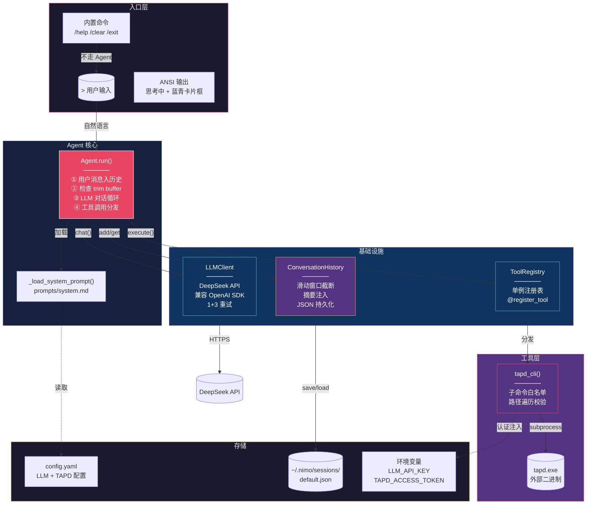
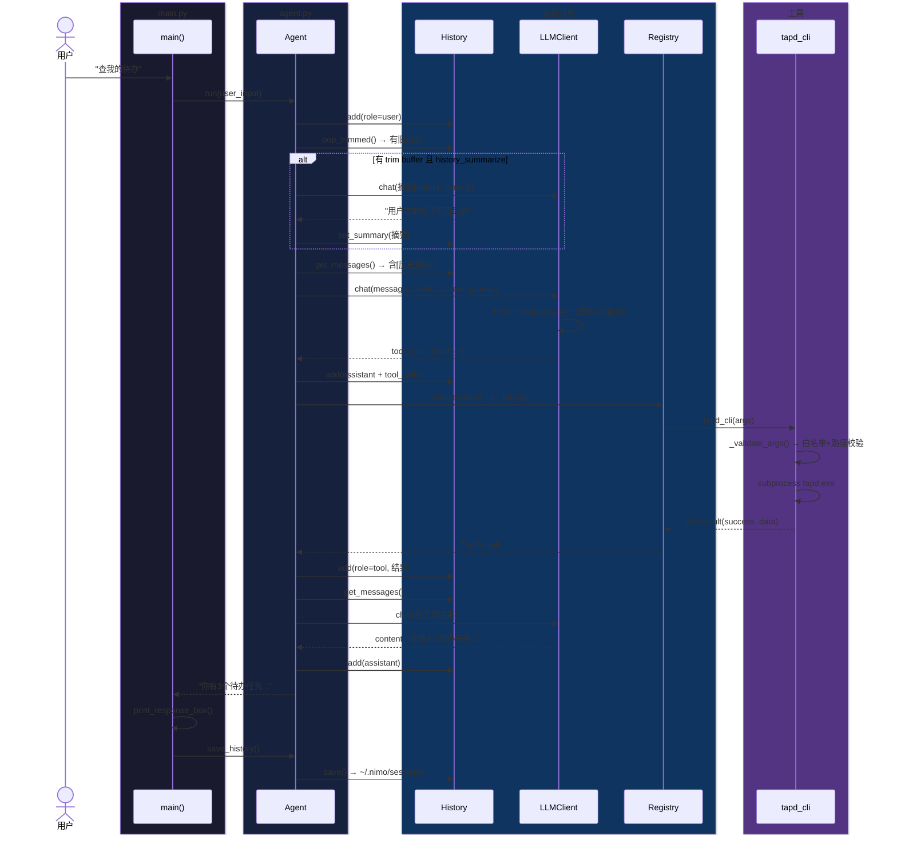
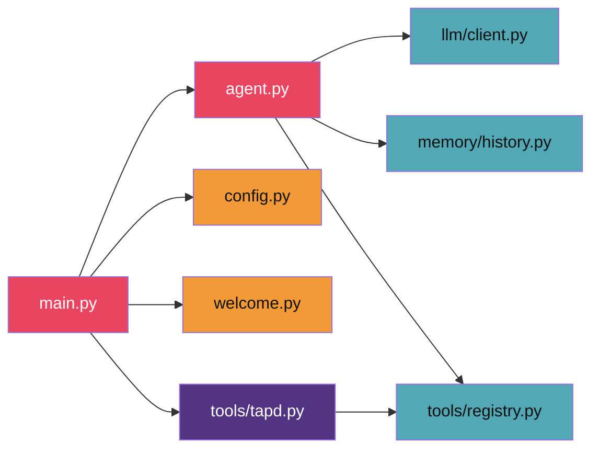

# Nimo 系统架构

## 系统架构总览

```mermaid
graph TB
    subgraph ENTRY["入口层"]
        CLI[("> 用户输入")]
        CMD["内置命令<br/> /help /clear /exit"]
        ANSI["ANSI 输出<br/> 思考中 + 蓝青卡片框"]
    end

    subgraph CORE["Agent 核心"]
        AGENT["Agent.run()<br/>──────<br/>① 用户消息入历史<br/>② 检查 trim buffer<br/>③ LLM 对话循环<br/>④ 工具调用分发"]
        PROMPT["_load_system_prompt()<br/>prompts/system.md"]
    end

    subgraph INFRA["基础设施"]
        LLM["LLMClient<br/>──────<br/>DeepSeek API<br/>兼容 OpenAI SDK<br/>1+3 重试"]
        HIST["ConversationHistory<br/>──────<br/>滑动窗口截断<br/>摘要注入<br/>JSON 持久化"]
        REG["ToolRegistry<br/>──────<br/>单例注册表<br/>@register_tool"]
    end

    subgraph TOOLS["工具层"]
        TAPD["tapd_cli()<br/>──────<br/>子命令白名单<br/>路径遍历校验"]
        BIN[("tapd.exe<br/>外部二进制")]
    end

    subgraph STORE["存储"]
        YAML["config.yaml<br/>LLM + TAPD 配置"]
        SESSIONS[("~/.nimo/sessions/<br/>default.json")]
        ENV["环境变量<br/>LLM_API_KEY<br/>TAPD_ACCESS_TOKEN"]
    end

    CLI -->|"自然语言"| AGENT
    CMD -->|"不走 Agent"| CLI
    AGENT -->|"chat()"| LLM
    AGENT -->|"add/get"| HIST
    AGENT -->|"execute()"| REG
    AGENT -->|"加载"| PROMPT
    REG -->|"分发"| TAPD
    TAPD -->|"subprocess"| BIN
    HIST -->|"save/load"| SESSIONS
    LLM -->|"HTTPS"| DS[("DeepSeek API")]
    PROMPT -.->|"读取"| YAML
    TAPD -.->|"认证注入"| ENV

    style ENTRY fill:#1a1a2e,stroke:#e94560,color:#eee
    style CORE fill:#16213e,stroke:#0f3460,color:#eee
    style INFRA fill:#0f3460,stroke:#533483,color:#eee
    style TOOLS fill:#533483,stroke:#e94560,color:#eee
    style STORE fill:#1a1a2e,stroke:#f29a38,color:#eee
    style AGENT fill:#e94560,stroke:#fff,color:#fff
    style HIST fill:#533483,stroke:#f29a38,color:#fff
    style LLM fill:#0f3460,stroke:#53a8b6,color:#fff
    style REG fill:#0f3460,stroke:#53a8b6,color:#fff
    style TAPD fill:#533483,stroke:#e94560,color:#fff
```

## Agent 运行时数据流

```mermaid
sequenceDiagram
    actor U as 用户
    box rgb(26,26,46) main.py
        participant M as main()
    end
    box rgb(22,33,62) agent.py
        participant A as Agent
    end
    box rgb(15,52,96) 基础设施
        participant H as History
        participant L as LLMClient
        participant R as Registry
    end
    box rgb(83,52,131) 工具
        participant T as tapd_cli
    end

    U->>M: "查我的待办"
    M->>A: run(user_input)
    A->>H: add(role=user)
    A->>H: pop_trimmed() → 有旧消息?
    alt 有 trim buffer 且 history_summarize
        A->>L: chat(摘要prompt, tools=[])
        L-->>A: "用户之前查了项目列表"
        A->>H: set_summary(摘要)
    end
    A->>H: get_messages() → 含[历史摘要]
    A->>L: chat(messages, tools, system_prompt)
    L->>L: POST DeepSeek API (最多4次重试)
    L-->>A: tool_calls: [tapd_cli]
    A->>H: add(assistant + tool_calls)
    A->>R: execute("tapd_cli", {args})
    R->>T: tapd_cli(args)
    T->>T: _validate_args() → 白名单+路径校验
    T->>T: subprocess tapd.exe
    T-->>R: ToolResult(success, data)
    R-->>A: ToolResult
    A->>H: add(role=tool, 结果)
    A->>H: get_messages()
    A->>L: chat(含工具结果)
    L-->>A: content: "你有3个待办任务..."
    A->>H: add(assistant)
    A-->>M: "你有3个待办任务..."
    M->>M: print_response_box()
    M->>A: save_history()
    A->>H: save() → ~/.nimo/sessions/
```

## 模块依赖（单向无循环）

```mermaid
graph LR
    MAIN["main.py"] --> AG["agent.py"]
    MAIN --> CFG["config.py"]
    MAIN --> WEL["welcome.py"]
    MAIN --> TAPD["tools/tapd.py"]

    AG --> LLM["llm/client.py"]
    AG --> HIST["memory/history.py"]
    AG --> REG["tools/registry.py"]

    TAPD --> REG

    style MAIN fill:#e94560,color:#fff
    style AG fill:#e94560,color:#fff
    style CFG fill:#f29a38,color:#111
    style WEL fill:#f29a38,color:#111
    style LLM fill:#53a8b6,color:#111
    style HIST fill:#53a8b6,color:#111
    style REG fill:#53a8b6,color:#111
    style TAPD fill:#533483,color:#fff
```
